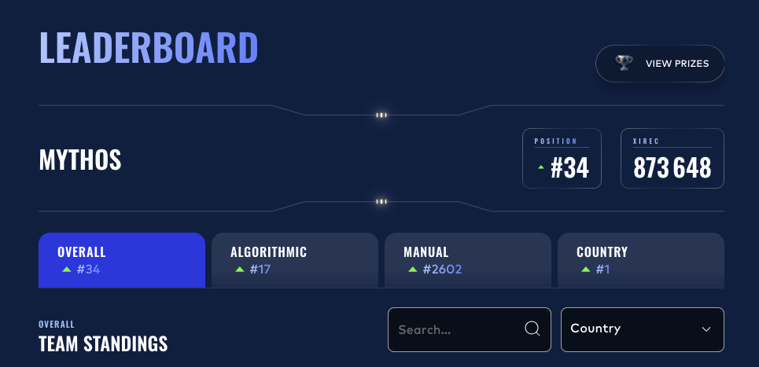
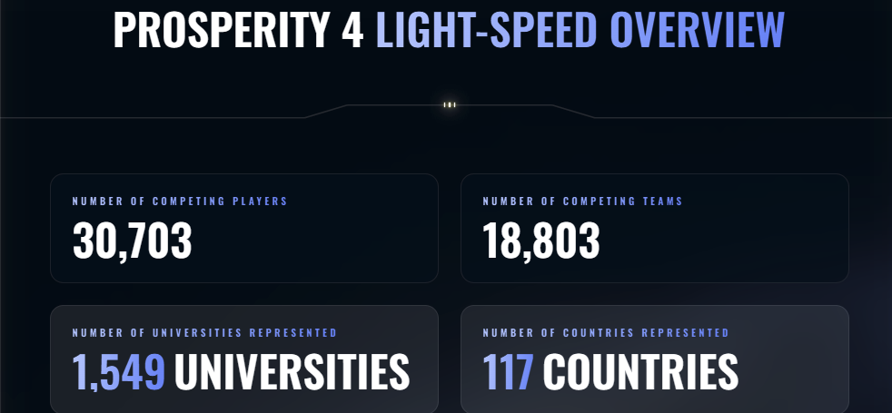
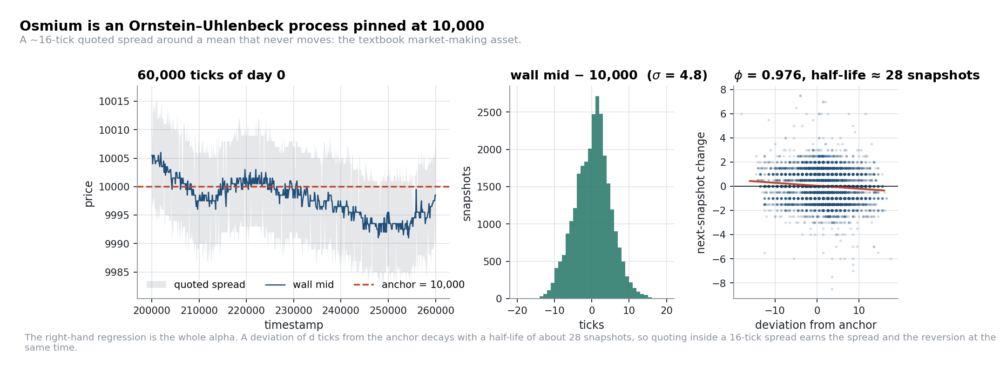
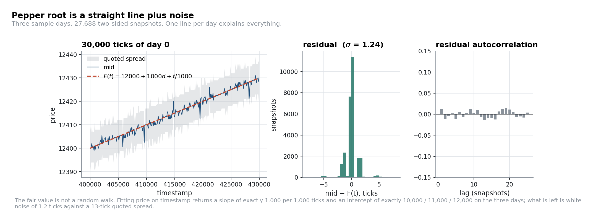
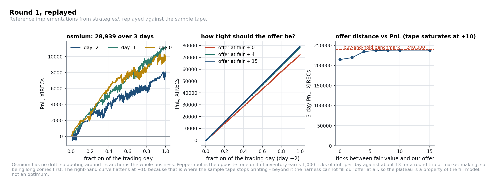

# IMC Prosperity 4: Team Mythos

*We're still adding material here. If you find this useful, a star helps us know it's worth the
continued effort.*

Two students from **KU Leuven**:
[William Muller](https://www.linkedin.com/in/william-muller1/) · [Tom Decort](https://www.linkedin.com/in/tom-decort/)


### 17th of 18,803 teams worldwide in the algorithmic challenge, top 0.09%

| Basis | Rank | Percentile |
|---|---|---|
| Algorithmic, worldwide | **17th** of 18,803 teams | top 0.09% |
| Overall, worldwide (algorithmic + manual) | **34th** of 18,803 teams | top 0.18% |
| Manual, worldwide | 2,602nd of 18,803 teams | top 13.8% |
| Overall, Belgium | **1st** | — |
| Overall, European Union | **4th** | — |

Field: 30,703 participants, 1,549 universities, 117 countries.

<p align="center">
  
</p>
<p align="center">
  
</p>

---

This repository is a retrospective write-up of how we approached IMC's 2026 global trading
competition: what the markets actually were, which statistical relationships we found, how we
turned them into strategies, what worked, what did not, and what we would do differently.

A note on timing: the competition ran in April 2026, and this repository was written six months
later. We no longer have a complete record of every experiment or every intermediate version of
every strategy. What follows is a reconstruction of the main ideas from our submitted code, our
notes, and a fresh re-analysis of the data. It is not a lab notebook, and where we are
reconstructing rather than reporting, we say so.

A word on where we put our effort, since it explains most of the results above. We were a team of
two against fields of four, and the algorithmic score carries, by our estimate, well over 90% of
the overall weight. So we put almost everything into the algorithmic side, aiming for the world
title there rather than a strong overall placement, which is the real reason for the gap between
17th in algorithmic and a far more modest top 13.8% in manual.

---

## Contents

| | |
|---|---|
| [What Prosperity is](#what-prosperity-is) | the competition, the scale, the two challenges |
| [How we worked](#how-we-worked) | the research loop, and Mythos |
| [Round 1: finding fair value](#round-1-finding-fair-value) | anchors, deterministic drift, quoting |
| [Round 2: the round we chose not to contest](#round-2-the-round-we-chose-not-to-contest) | why a qualifier only pays once |
| [Round 3: the voucher surface](#round-3-the-voucher-surface) | delta ladders, basis, why we skipped the smile |
| [Round 4: counterparties](#round-4-counterparties) | a t-statistic of 26 that meant nothing |
| [Round 5: fifty products](#round-5-fifty-products) | lattices, baskets, and multiple testing |
| [The manual challenge](#the-manual-challenge) | where we lost, honestly |
| [Repository layout](#repository-layout) | what is where, and how to run it |

Deep dives live in [`docs/`](docs/). Reference implementations live in [`strategies/`](strategies/).

---

## What Prosperity is

[IMC Prosperity](https://prosperity.imc.com/) is a 16-day online trading competition for STEM
students, run by IMC Trading. Teams trade a simulated exchange populated by bot market makers and
bot takers. It has two independent challenges:

**Algorithmic.** You submit a single Python file containing a `Trader` class with one method:

```python
def run(self, state: TradingState) -> tuple[dict[str, list[Order]], int, str]:
    ...
```

Each round it is executed against a fresh simulated trading day of 10,000 order-book snapshots. At
every snapshot you see the current book (three price levels per side), the public trade tape, and
your own positions, and you return limit orders.

It is, at its core, a quant research problem compressed into 72 hours: build a statistical model of
a market you have never seen, decide what is real signal versus noise, size risk against hard limits,
and ship code that survives contact with a live order book.

Rounds 1 and 2 work as a qualifier on two simple products, with a 200,000-XIREC threshold to
advance. The leaderboard then resets to zero, and Rounds 3 through 5 decide the competition: an
option chain across Rounds 3 and 4, then in Round 5 fifty brand new products and 48 hours to work
out which of them are even tradable.

**Manual.** Each round also carries its own self-contained puzzle: an auction, a portfolio
allocation, an exotic-option pricing problem, a news-trading game. These score into the same PnL
total as the algorithmic challenge. Several of them reward reading the field as much as solving the
math, closer to game theory than to trading: what you should do depends on what you expect everyone
else to do.

---

## How we worked

Two people, 72 hours per round in Phase 1 and 48 in Phase 2, and a research question that changes
completely between rounds. What actually limited us was how many ideas we could evaluate before the deadline, and how
reliably we could reject the bad ones. Neither raw intelligence nor coding speed had much to do
with it.

To that end, we spent a significant amount of time building two tools we considered essential: a
multimodal agentic research pipeline, internally called alpha_researcher_v2, that multiplied our
research capacity well beyond what two people could manage by hand, and an internal harness,
Mythos, also our team name, whose only job was to break a candidate idea against a battery of
statistical tests: Sharpe ratio, Deflated Sharpe ratio, VaR/CVaR, win ratio, HHI concentration, and
bootstrap confidence intervals.

For real market applications, and for any future Prosperity run, we are keeping both tools as trade
secrets and will not be publishing them here.

What follows is what two people and those tools were able to produce.

---

## Round 1: finding fair value

**Products:** `ASH_COATED_OSMIUM`, `INTARIAN_PEPPER_ROOT`. Position limit 80 each.
**Full write-up:** [`docs/02-round-1-fair-value.md`](docs/02-round-1-fair-value.md)

Every Prosperity round reduces to the same question: *what is this thing worth right now?* Round 1 is
the round where you learn that the answer is sometimes exact.

**Osmium** is an Ornstein–Uhlenbeck process pinned at 10,000. Fitting an AR(1) to the deep-book mid
gives φ between 0.95 and 0.98 depending on the day, a half-life of 14 to 28 snapshots, with a
standard deviation of 4.8 ticks inside a quoted spread of 16. That combination is the definition of a market-making asset: the spread you
collect is three times the size of the deviations you are absorbing.



**Pepper root** is not stochastic at all. Regressing mid on timestamp gives a slope of exactly 1.000
per 1,000 timestamps and an intercept of exactly 10,000 / 11,000 / 12,000 on the three sample days:

$$F(t) = 12{,}000 + 1{,}000\,d + \frac{t}{1{,}000}$$

with a residual standard deviation of **1.24 ticks** and no autocorrelation left in the residual.
The fair value is a straight line and the market quotes a 13-tick spread around it.



The interesting part is what to do with that. Over one day the fair value rises by 1,000 ticks, so a
unit held all day is worth 1,000 ticks while a market-making round trip on the same product captures
roughly the 13-tick spread. Inventory dominates by an order of magnitude, and the first job of the
strategy is to be long. The two are nevertheless **additive, not exclusive**: a round trip returns
the inventory it consumed, and the only cost is the drift forgone while flat. The tape prices that
cost directly: a per-side fill rate of 0.017 per tick at an average size of 5.2 puts the expected
round-trip time near 59 ticks, or **5.9 ticks of forgone drift against 13–14 ticks of captured
spread**. Market making on top of the long position pays; it is simply second in line.



Our algorithm swept the ask book to the full limit and then offered 15 ticks above fair: the right
first-order decision, and the wrong second-order one. At 80 of 80 there is no capacity left to take a
cheap ask or to quote into a thin book. Targeting +76 rather than the full +80 keeps four units of
headroom for exactly that reason, and it is a cheaper insight than any model.

One more thing from this round. Roughly 8% of snapshots have an **empty side of the book** (about 4%
on each side), and that state is where the round's largest edge lives: a taker arriving there has to
trade against whatever is quoted, so a quote posted into an empty side can sit far outside the normal
spread and still fill. How far is not knowable from the historical tape: it records only trades that
happened without us in the book, and its widest osmium print (+26 ticks through fair) is exactly the
widest quote that ever existed in the sample data. Finding the real limit means posting wide quotes on
the live platform and watching what fills. We were still getting to grips with the competition in
Round 1 and never ran that experiment. In hindsight, it is probably where the largest edge in the
round was sitting, and we left it on the table.

---

## Round 2: the round we chose not to contest

Rounds 1 and 2 are a qualifier, and a qualifier only pays once: clear the 200,000-XIREC threshold and
the leaderboard is reset to zero for Phase 2. Nothing else about a Phase-1 score carries forward.

Round 1 already left us around **900th of 18,803 teams**, comfortably through. With qualification
essentially secured, we played Round 2 safe rather than for edge, and put the time into the tooling
that Rounds 3–5 would actually be decided on instead. That is why there is no Round-2 write-up here.

---

## Round 3: the voucher surface

**Products:** `HYDROGEL_PACK`, `VELVETFRUIT_EXTRACT`, and ten call vouchers `VEV_4000 … VEV_6500`.
Limits 200 / 200 / 300 per strike.
**Full write-up:** [`docs/03-round-3-voucher-surface.md`](docs/03-round-3-voucher-surface.md)

This is the round where the competition starts rewarding structure over intuition. Ten strikes on
one underlying, five days to expiry, and a lot of ways to be clever and wrong.

The first thing we did was measure the chain rather than model it. Regressing each voucher on the
underlying recovers an **empirical delta ladder** running from 1.00 at K = 4000 to 0.05 at K = 5500;
the time value collapses to zero for the deep in-the-money strikes. The middle of the chain
barely trades at all: `VEV_5000` printed **one unit** across three sample days, against 787 on
`VEV_5400` and 940 on `VEV_4000`.


That combination, a clean delta ladder, no flow in the middle, and wide spreads, determines
everything about the round.

**1. The deep-ITM vouchers are a synthetic forward.** `VEV_4000` tracks $S - 4000$ with a basis
standard deviation of **0.83 ticks** and an empirical delta of 0.9997. Its fair value is *derived*,
not estimated.


The obvious follow-up is to call this an arbitrage and cross the spread when the basis moves. That
is wrong, and checking it is instructive: the voucher book is quoted symmetrically around intrinsic
and is 21 ticks wide, and in three days of data there is **not one snapshot** where the best ask sits
two ticks below intrinsic. The relationship is worth nothing as a taking edge and a lot as a *quoting*
edge: a few ticks either side of a fair value known to within one tick, in a 21-tick book, hedged
one-for-one in the underlying. It is also the only strike with the two-sided flow to support quoting
([`strategies/synthetic_forward_mm.py`](strategies/synthetic_forward_mm.py)).

**2. The chain is leverage on the underlying, not a relative-value book.** A voucher spread
$C(K_1) - C(K_2)$ looks like relative value and is 98% delta. Regress the underlying out,

$$z_t = \big(C_{K_1,t} - C_{K_2,t}\big) - \beta\,\big(S_t - S_{\text{ref}}\big), \qquad \beta = \Delta_{K_1} - \Delta_{K_2}$$

and σ falls from **12.5 ticks to 1.7**. The residual is the elegant object and the untradable one:
around its own moving mean it disperses by **0.64 ticks against an executable width of 7.42**. You
would pay eleven times the whole signal to trade it, and the deep strikes have no flow to quote into.


What the chain *is* good for is expressing the underlying's mean reversion with delta-sized leverage.
Velvetfruit reverts around 5,250 with a deviation σ of 15.6, and each voucher is that deviation times
its delta. Our submission ran thirteen delta-adjusted voucher positions off that single view, entering
at roughly ±23 ticks of underlying deviation (about 1.5× velvetfruit's own σ of 15.6, enough to
trade real excursions without firing on every wiggle inside the band), with every reference level
tracked by an EWMA rather than fixed and with shared-leg accounting so that overlapping positions
could not jointly breach a voucher's limit.
[`strategies/voucher_delta_expression.py`](strategies/voucher_delta_expression.py) is one position of
that book.

**What we deliberately did not do: trade the volatility smile.** Fitting Black–Scholes to the chain
is easy, and a lot of teams did it. But the surface is flat at **24.2%**: every strike sits between
23.0% and 25.0%, with the daily median moving less than a quarter of a point. One standard deviation
of implied-volatility movement is worth about **one tick** of option price, less than the round-trip
spread on every strike.


There is a real smile in there. It is simply smaller than the transaction cost of expressing a view
on it. Measuring the size of an effect *in the units you would have to trade it in* is, in our
experience, the single highest-yield habit in this competition. The cross-strike residual above
is the case where we should have applied it to our own idea as hard as we applied it to the textbook
one.

---

## Round 4: counterparties

**Products:** unchanged. **New information:** every print on the trade tape now carries a
counterparty identity: `Mark 01`, `Mark 14`, `Mark 22`, `Mark 38`, `Mark 49`, `Mark 55`, `Mark 67`.
**Full write-up:** [`docs/04-round-4-counterparties.md`](docs/04-round-4-counterparties.md)

Measuring each counterparty's execution edge against the prevailing mid immediately sorts them into
roles. Mark 14 collects ~6.5 ticks on both sides of every trade: the profitable market maker. Mark
38 pays ~8.5 ticks on both sides and trades hydrogel against Mark 14 in 98% of its prints: a pure
price taker. The bilateral flow matrix is sparse: each participant has one role and a small set of
habitual partners. Then measure the same edge against the *wall mid* (the midpoint of the deepest
level on each side, which ignores thin quotes posted inside the spread), and every number stays put,
except one.


That exception is where we nearly lost the round. `Mark 67` appears on the tape as a **buyer 165 times
and as a seller never**. Run an event study on the touch mid around his prints and it rises **1.97
ticks within 100 timestamps and stays there**: a t-statistic of 26, with a monotone,
permanent-looking impact curve. Textbook informed flow. Run the identical study on the wall mid and
the same 165 events predict **0.07 ticks**.


Three numbers say why. The touch mid falls 1.78 ticks in the 100 timestamps *before* the print, sits
1.88 ticks below the wall mid *at* the print, and rises 1.97 ticks *after*: one round trip of a
transient quote, measured three ways. And against the wall mid, Mark 67 collects **1.08 ticks at
execution** where the touch mid says he pays 0.8. He is lifting offers that are already cheap, not
forecasting anything. The "signal" was a detector for our own estimation error.

This is not a hypothetical trap. Read on the touch mid alone, Mark 67 fits the profile of a genuinely
informed trader almost exactly: a sustained lift of about 2 ticks within 100 timestamps, with a
t-statistic that would clear almost any significance bar. It would be easy to build a live signal on
that read alone and trade it with real size. The two mid definitions disagree about what actually
happened, and one open marker on a bar chart settles which one is right.

The tradable structure was in *detecting the dislocated quote*, not in the identity itself, and that
detection needs a robust fair value and no tape at all. Marks 22 and 49 sell velvetfruit about a
tick through the wall mid, and the touch sits 1.5 ticks or more through it in **4.8% of snapshots**:
a few hundred chances a day, worth a tick and a half each. Our submitted Round-4 algorithm took none
of them; it stayed on the option surface. So this section is a reconstruction of what we should have
built, not a description of what we did.

**The general rule this taught us:** before believing an event study, re-run it against a different
definition of the price. If the signal depends on which mid you use, the signal *is* the mid.

---

## Round 5: fifty products

**Products:** 50 new goods in 10 families of 5, all previous products delisted. Position limit 10 on
every product. 48 hours.
**Full write-up:** [`docs/05-round-5-fifty-products.md`](docs/05-round-5-fifty-products.md)

Round 5 is a search problem wearing a trading problem's clothes. Fifty products, three days of
history, and 1,225 possible pairs. The winning move is finding the ones that are *mechanisms* rather
than coincidences, not chasing the largest count of significant relationships.

### The trap

Screen all 1,225 pairs for cointegration on days 2–3, then re-test the surviving hedge ratios on
day 4:

- **248 pairs (20.2%)** pass an ADF test at the 5% level in sample;
- **2.8% of them** are still significant out of sample;
- and 50 *independent random walks* of the same length produce a 13.8% in-sample hit rate all by
  themselves.


A screen that selects on p-values alone is a machine for generating confident nonsense. We ran this
check during the competition and it is the reason we did not submit a pairs book in Round 5. It cost
us maybe two hours and it is the highest-return two hours we spent.

### The mechanism

Some Round-5 mid prices are **quantised**: the observed price is the latent price rounded onto a
100-wide lattice. On `ROBOT_DISHES`, day 4, 30% of all non-zero price changes are exactly ±100, and a
±100 move is followed by a move in the opposite direction **87.3%** of the time. That is a martingale
argument, not a statistical curiosity. If the observed price just crossed a grid
boundary, the latent price is sitting near that boundary, so the next crossing is more likely to go
back than to continue.


Crucially, the right-hand panel is the control. `PEBBLES_XL` produces just as many ±100 moves and
alternates at exactly 50%. It is simply volatile. A screen based on jump *count* would have put it
straight into the basket; a screen based on the *mechanism* excludes it. Trading the reversal is
worth about 40 ticks per event against a half-spread cost of roughly 4:


We armed this detector on **every** product rather than the four that showed the pattern in the
sample data: the regimes switch on and off between days (ROBOT_IRONING was active on day 2 and
silent on day 4; ROBOT_DISHES the reverse), so hard-coding the product list would have been a bet on
which day we were given. Replaying the generic rule product by product shows exactly the separation
you would want, including a loss on the decoy:


### The bet we got away with

Our Round-5 submission also held **maximum directional exposure** in five products from tick zero,
justified in the code comments by "R² > 0.75". Those R² values are real: 0.912, 0.912, 0.900, 0.806,
0.785, and they are not measuring a trend. They come from one straight line fitted through all three
days concatenated, so the fit is driven by the level gaps *between* days rather than by anything
happening *within* one. `MICROCHIP_OVAL` has a pooled R² of 0.912 and a day-2 R² of **0.000** on a
slope of −0.01: it never trended that day, it just opened lower the next one. All five collapse on at
least one day, and at population level 13 of the 50 products trend the same way on all three days
against a coin-flip expectation of 12.5.


The structural fix is one line: **fit the model at the frequency you intend to trade at.** A trend you
hold for a day has to be visible inside a day.

That 13-against-12.5 comparison can be turned into an actual number: testing the observed count
against the fair-coin null puts it almost exactly at its expected value, $P(X \geq 13) \approx 0.49$,
so there is no population-level evidence the R² screen finds real persistence. The honest prior on
each of our five picks was close to a coin flip, not the 80-90% the R² figures implied
([full derivation](docs/05-round-5-fifty-products.md#5-the-bet-we-got-away-with)).

The bet paid off, but it is still the weakest thing we submitted. The market-making floor and the
lattice trade were skill; the directional overlay was five roughly 50/50 positions we chose to accept
at the position limit. That is a defensible decision *as a tournament choice*, and a poor one as a
research conclusion, and the two should never be confused.

### An identity, a trade, and telling them apart

`PEBBLES_XS + S + M + L + XL = 50,000`, on every day, at every timestamp, with a standard deviation of
**2.80 ticks** while the individual pebbles move by 1,500 to 5,300 ticks a day.


A hard accounting identity, immune to the multiple-testing problem, but too wide to arbitrage. Crossing
five spreads to put the basket on costs **65 ticks** against a 2.8-tick signal, and in three days there
is not one snapshot where the basket could be sold above 50,000. What the identity gives you is the
most precise **fair value** in the round: given four pebbles you know the fifth exactly, which makes
quoting all five essentially risk-free. Market-making the pebbles on that basis is what we did.

The trade we missed was next door. The snack-pack family screens *worse* (the chocolate/vanilla sum
drifts 155 ticks across three days, so it is a tendency rather than an identity), but the
chocolate−vanilla spread disperses by **372 ticks against a 34-tick round-trip cost**, an 11:1 ratio
running exactly the opposite way to the pebbles ([figure](figures/r5_snackpack_structure.png)). We
market-made the family and left that spread alone, which in hindsight was the larger opportunity.

**An exact relationship with a wide spread is a fair value; a loose relationship with a wide dispersion
is a trade.** We had one of each in front of us, labelled them correctly, and then ranked them by
tightness instead of by dispersion-over-cost.

---

## The manual challenge

We finished **2,602nd in manual**, and we should be clear that this was a resourcing decision rather
than a research failure: with two people and 48-hour rounds we spent nearly all of our time on the
algorithm. For completeness, and because future participants should not repeat this, the manual
rounds were:

| Round | Problem | Character |
|---|---|---|
| 1 | Sealed-bid auction into a guaranteed buyback at a fixed price | Fully deterministic: the book is fixed and you submit last, so brute force returns the exact optimum, near-free points |
| 2 | Allocate a 50,000 budget across three growth pillars | Allocation under uncertainty |
| 3 | Bidding against the rest of the field | A beauty-contest / level-*k* problem: your optimum depends on the crowd's distribution |
| 4 | Vanilla, chooser, binary and knock-out options on a GBM underlying with 251% annualised vol, scored as the average PnL over 100 simulations | Straightforward Monte Carlo pricing plus a genuine risk-budgeting decision |
| 5 | News-driven trading across nine goods | Pattern-matching against previous editions, plus crowd modelling |

Round 4 in particular is a pure quantitative exercise that maps onto exactly the skills the
algorithmic side rewards: price the exotics by simulation, then choose a position on the
expected-PnL / CVaR frontier. It is bounded, low-variance work with no execution risk. **Not giving
it real thought was the most expensive decision we made in the entire competition**, and it cost us
far more places than any algorithmic choice did.

---

## Repository layout

```
imc-prosperity-4/
├── docs/               deep dives: the competition, each round, our method, the lessons
├── strategies/         readable reference implementations of the ideas above
├── figures/            generated output (committed so the README renders)
└── images/             leaderboards and competition material
```

### Reading the strategies

The files in [`strategies/`](strategies/) are teaching versions, not our submissions: one idea each,
parameters at the top, short enough to read in one sitting. They import the competition's
`datamodel` module directly, so they are ready to drop into the Prosperity IDE as-is.

---

## Acknowledgements and licence

Thanks to IMC Trading for running a competition that is far more interesting than it needs to be,
and to the teams who published detailed write-ups of previous editions. Reading them before Round 1
was worth more than anything we did during it. If this repository is useful to you in a future
edition, that is the point of it.

Code is MIT-licensed ([`LICENSE`](LICENSE)). The competition data, product names and screenshots are
IMC's.

*William Muller · Tom Decort · KU Leuven, 2026*
