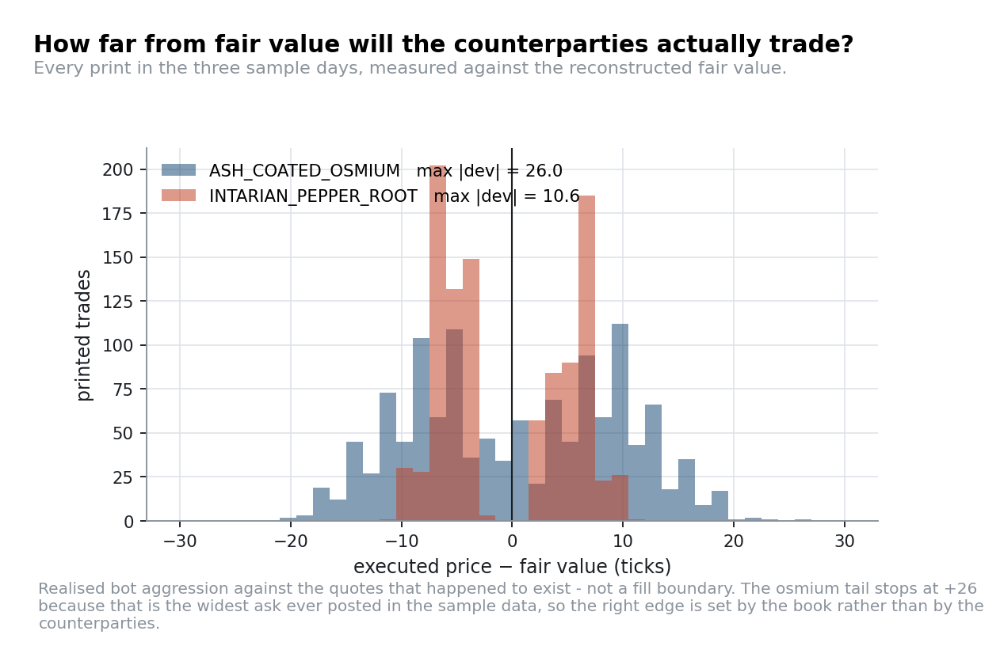

# Round 1: finding fair value

**Products** `ASH_COATED_OSMIUM`, `INTARIAN_PEPPER_ROOT` · position limit 80 each
**Data** three sample days · ~27,700 two-sided snapshots after cleaning
**Code** [`strategies/anchored_market_maker.py`](../strategies/anchored_market_maker.py),
[`strategies/deterministic_drift.py`](../strategies/deterministic_drift.py) ·
[`research/figures/fig_round1.py`](../research/figures/fig_round1.py)

---

## 1. Estimating the price before modelling the price

Both products are quoted by a small number of bot market makers with recognisable behaviour: one
posts a wide, very deep pair of levels, others post thinner quotes inside it. The touch mid is
therefore noisy in a specific, avoidable way. It moves whenever a thin quote appears or disappears,
even though nothing about the underlying value has changed.

Taking the midpoint of the *deepest* level on each side instead ("wall mid") removes most of that:

| Estimator | σ of the level | σ² of the tick-to-tick change |
|---|---:|---:|
| Touch mid | 4.86 | 3.73 |
| Wall mid | 4.75 | **1.33** |

The level statistics barely move; the *change* variance falls by a factor of 2.8. Since every
threshold you will ever write is compared against a deviation of this estimator, that factor
propagates into every downstream decision. It is also what saves us in
[Round 4](04-round-4-counterparties.md), where the touch mid manufactures a signal that does not
exist.

A caveat on the pooled figures below: `mid_price` in the CSVs is emitted even when a side of the book
is empty, and left in it destroys every summary statistic. Osmium's mid has a standard deviation of
4.86 on two-sided snapshots and 404 if you keep the rest. Filter first.

```python
def wall_mid(book):
    bid = max(book.buy_orders.items(),  key=lambda kv: kv[1])[0]   # deepest bid level
    ask = max(book.sell_orders.items(), key=lambda kv: -kv[1])[0]  # deepest ask level
    return (bid + ask) / 2
```

## 2. Osmium: an anchored Ornstein–Uhlenbeck process

Fitting an AR(1) to the wall mid,

$$x_{t+1} - \mu = \phi\,(x_t - \mu) + \varepsilon_t$$

gives, on the three sample days:

| Day | $\mu$ | $\phi$ | half-life $\ln 2 / (-\ln\phi)$ | σ of the deviation |
|---|---:|---:|---:|---:|
| −2 | 9,998.1 | 0.9677 | 21 snapshots | 4.61 |
| −1 | 10,000.9 | 0.9508 | 14 snapshots | 3.68 |
| 0 | 10,001.7 | 0.9755 | 28 snapshots | 5.12 |
| **pooled** | **10,000.2** | **0.971** | **23 snapshots** | **4.8** |

Median quoted spread: **16 ticks**. The three $\phi$ estimates are not statistically compatible with a
single value at $n = 10{,}000$, so the pooled row is a summary rather than a parameter estimate. It
makes no difference to the design: anything in 0.95–0.98 implies the same quoting policy.


The mean does not move across days (9,998.2 / 10,000.8 / 10,001.6), so the anchor is a constant, not
something to estimate online. Worth knowing that a constant is still a risk: the scored day is out of
sample by construction, and hard-coding 10,000 with no fallback means a single mis-estimated anchor
pins inventory at the limit for the entire scored day with no way to recover mid-round. The cheap
insurance is a fail-safe rather than a better estimate: if inventory sits at the limit for more than
*N* ticks, start blending the assumed fair value toward the observed wall mid.

Two consequences:

**The spread dominates the risk.** You are being paid 16 ticks to warehouse a deviation whose
standard deviation is 4.8 and which decays with a half-life of roughly 23 snapshots. The trade is
a fee for immediacy, not a directional bet.

**Inventory is a real but small cost.** Skewing quotes against inventory is worth doing, since it pulls
you back to flat while the deviation decays, but the skew coefficient is not a sensitive parameter.
The reference implementation uses 0.06 ticks per unit; anything in 0.03–0.10 behaves the same, which
is exactly the kind of flat parameter surface you want to see before shipping.

The reference implementation is the standard three-step pattern:

1. **take** everything on the wrong side of fair (asks below 10,000, bids above);
2. **quote** the remaining capacity one tick inside the touch, clamped so we never quote through fair;
3. **skew** both quotes by `INVENTORY_SKEW * position`.

Replayed against the sample tape it earns 28,939 over three days on a single product: small, but
almost perfectly steady, which is what a market-making component should look like.

## 3. Pepper root: the fair value is a straight line

Regressing mid on timestamp, per day:

| Day | slope (per 1,000 ts) | intercept | residual σ | residual lag-1 autocorrelation |
|---|---:|---:|---:|---:|
| −2 | 1.0000 | 9,999.96 | | |
| −1 | 1.0001 | 10,999.95 | | |
| 0 | 1.0000 | 11,999.98 | | |
| **pooled** | **1.000** | exact ×1,000 steps | **1.24** | 0.02 |

$$F(t) = 12{,}000 + 1{,}000\,d + \frac{t}{1{,}000}$$


There is no model risk here at all: the residual is white noise of 1.24 ticks against a 13-tick
quoted spread. The interesting question shifts from *what is it worth* to *what do you do about it*.

### Ranking the two edges

Over one simulated day the fair value rises by **1,000 ticks**. With a limit of 80 units, holding the
maximum long position all day is worth **80,000**. A full market-making round trip on the same product
captures roughly the quoted spread, about 13 ticks. Inventory dominates by an order of magnitude, so
the first job of the strategy is to be long, and paying the spread to get there costs about 500
against 80,000 of drift.

The two are additive rather than exclusive, though: a round trip *returns* the inventory it consumed,
and the only cost is the drift forgone while flat. The tape prices that cost directly: a per-side
fill rate of 0.017 per tick at an average size of 5.2 puts the expected round-trip time near 59
ticks, or **5.9 ticks of forgone drift against 13–14 ticks of captured spread**. Quoting pays; it is
second in line, not free.

Replaying the reference implementation across the sample days:

| Offer distance from fair | 3-day PnL |
|---|---:|
| +0 (tight, symmetric) | 214,755 |
| +2 | 219,346 |
| +4 | 234,546 |
| +6 | 237,268 |
| +10 | 238,054 |
| +15 | 238,054 |
| *buy-and-hold benchmark: drift × limit × 3 days* | *240,000* |


Read that table with its limits stated. It saturates at +10, which is exactly where the sample tape
stops printing (maximum pepper aggression: +10.6), so the flat section is a property of the tape and
not of the quote. And the harness matches passive orders against a fixed tape, so it has no model of
fill probability and will always prefer a wider quote. See the caveats in
[`research/replay.py`](../research/replay.py). What it legitimately shows is that a symmetric quote
*at* fair value is worse than holding, because it gives up drift for zero edge. The benchmark row is a
reference point, not a ceiling.

Our submitted algorithm swept the ask book to the limit, rested a bid a few ticks under the touch and
offered 15 ticks above it. That is the right first-order decision and the wrong second-order one: at
80 of 80 there is no capacity left to take a cheap ask or to quote into a thin book. Targeting +76
rather than the full +80 keeps four units of headroom for precisely that reason, and it is a cheaper
insight than any model. We also never derived $F(t)$ explicitly during the round. We inferred the
drift from the tape and handled it heuristically.
Having the closed form makes the bid side strictly better and tells you exactly how far above fair you
can afford to offer.

## 4. Quoting width, and the edge we did not chase

Every print in the three sample days, measured against the reconstructed fair value:



| Product | median \|dev\| | 95th pct | max |
|---|---:|---:|---:|
| `ASH_COATED_OSMIUM` | 8 | 16 | 26 |
| `INTARIAN_PEPPER_ROOT` | 6 | 9.2 | 10.6 |

This is realised bot aggression against the quotes that happened to exist, which is not the same thing
as a fill boundary: the widest ask ever posted in the sample data is +26 from fair, exactly the largest
observed deviation, so the right tail is set by the book rather than by the counterparties.

That matters because **7.8% of snapshots have no quote on one side of the book** (4.0% missing a bid,
3.9% missing an ask, 0.16% missing both). A taker arriving there has to trade against whatever is
quoted, so a quote posted into an empty side can sit far outside the normal spread and still fill.
How far is only discoverable by posting one on the live platform and watching the fill rate. We were
still finding our feet in Round 1 and never ran that experiment. Given that 7.8% of snapshots offer
this opening, it is plausibly one of the largest sources of unclaimed Round-1 PnL we left on the
table.

---

**Next:** [Round 3: the voucher surface](03-round-3-voucher-surface.md)
