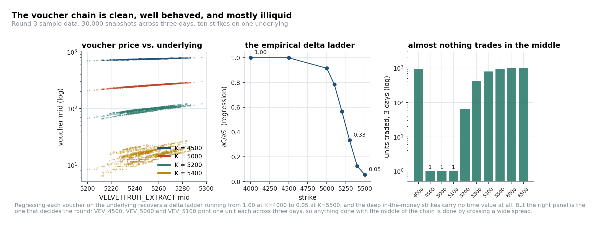
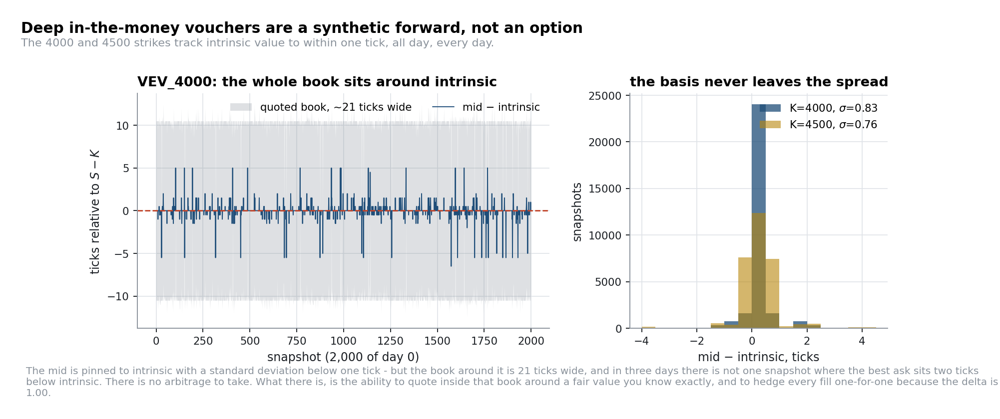
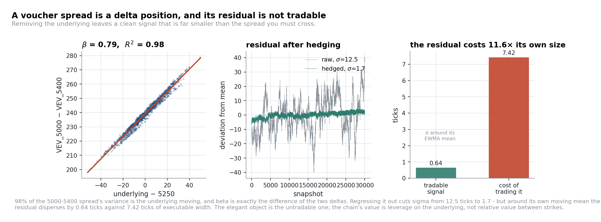
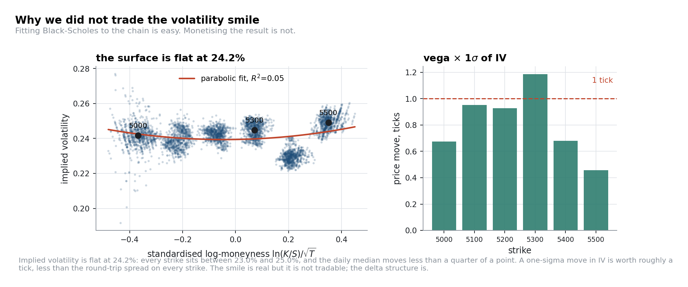

# Round 3: the voucher surface

**Products** `HYDROGEL_PACK` (limit 200), `VELVETFRUIT_EXTRACT` (200), ten call vouchers
`VEV_4000 … VEV_6500` (300 each) · **TTE** 5 days at the start of the scored round
**Code** [`strategies/synthetic_forward_mm.py`](../strategies/synthetic_forward_mm.py),
[`strategies/voucher_delta_expression.py`](../strategies/voucher_delta_expression.py)

---

## 1. The two delta-one products

Both `HYDROGEL_PACK` and `VELVETFRUIT_EXTRACT` are slow mean-reverting series. Fitting AR(1) to the
wall mid across the three sample days:

| | anchor $\mu$ | $\phi$ | half-life | σ of deviation | median spread |
|---|---:|---:|---:|---:|---:|
| `HYDROGEL_PACK` | 9,991 | 0.99820 | ≈ 384 snapshots | 31.9 | 16 |
| `VELVETFRUIT_EXTRACT` | 5,250 | 0.99816 | ≈ 377 snapshots | 15.6 | 5 |

Compare with Round-1 osmium (half-life ≈ 23, σ 4.8, spread 16). Same *shape*, completely different
trade. Here the deviation is six times the size of the spread and takes fourteen times longer to
decay, so quoting continuously around the anchor means warehousing large inventory for thousands of
ticks. The right structure is a **band**: stay out of the middle, accumulate on large excursions,
unwind on the way back. We used ±35 ticks on hydrogel and ±14 on velvetfruit, close to one σ of each
product's own deviation (31.9 and 15.6). The exact width barely matters: with a half-life of roughly
380 snapshots either way, the threshold mostly decides how often you enter, not whether a given
excursion reverts, so anything from a fraction of a σ to a couple of σ captures most of the same
trade. What matters is *having* a band rather than a continuous quote.

One estimator warning, because it recurs in [Round 4](04-round-4-counterparties.md). The
first-difference autocorrelation of the **touch** mid is −0.13 on hydrogel and −0.16 on velvetfruit,
which looks like exploitable short-horizon reversion. On the **wall** mid the same statistics are
**−0.018 and −0.042**: three quarters to seven eighths of the effect was bid-ask bounce, not price
reversion. Either way it is far too small to trade through a 16-tick spread, but which mid you
measure with decides what you think you have found.

## 2. Measuring the chain instead of modelling it

Ten strikes, one underlying, five days to expiry. Before writing a single line of Black–Scholes we
regressed each voucher's mid on the underlying's mid across all 30,000 snapshots, and counted how
much each strike actually traded:

| Strike | mean price | mean time value | empirical $\partial C/\partial S$ | median spread | **volume, 3 days** |
|---:|---:|---:|---:|---:|---:|
| 4000 | 1,250.11 | **0.01** | **0.9997** | 21 | 940 |
| 4500 | 750.11 | **0.01** | **0.9994** | 16 | **1** |
| 5000 | 255.02 | 4.92 | 0.9153 | 6 | **1** |
| 5100 | 166.81 | 16.71 | 0.7843 | 4 | **1** |
| 5200 | 95.55 | 45.45 | 0.5651 | 3 | 63 |
| 5300 | 46.76 | 46.76 | 0.3336 | 2 | 420 |
| 5400 | 15.95 | 15.95 | 0.1257 | 1 | 787 |
| 5500 | 6.64 | 6.64 | 0.0549 | 1 | 937 |
| 6000 | 0.50 | 0.50 | 0.0000 | 1 | 1,002 |
| 6500 | 0.50 | 0.50 | 0.0000 | 1 | 1,002 |

Four facts fall straight out of that table, none of which needed an option model:

1. **The 4000 and 4500 strikes have no optionality left.** Zero time value, delta 1.00.
2. **The delta ladder is smooth and monotone**, so any combination of strikes has a predictable net
   delta.
3. **The middle of the chain barely trades.** `VEV_4500`, `VEV_5000` and `VEV_5100` printed *one unit
   each* across three days. Whatever you want to do with those strikes, you will be doing it by
   crossing the spread, and you will not be doing much of it.
4. **The 6000 and 6500 strikes are a 0 bid and a 1 ask, all day.** Because settlement is against a
   hidden fair value bounded below by zero, quoting a 0 bid in size is a free option on that value
   being above zero. It is worth a couple of hundred XIRECs a round: trivial, but a clean
   illustration that "no spread to capture" and "no edge" are different statements.

## 3. Trade one: a fair value you derive rather than estimate

For the deep in-the-money strikes,

$$C_{K,t} = S_t - K + \epsilon_t, \qquad \sigma(\epsilon) = 0.83 \text{ ticks } (K = 4000), \quad 0.76 \text{ ticks } (K = 4500)$$

The instinct is to call this an arbitrage: watch the basis, cross the spread when it dislocates. We
checked, and the check is worth writing down.

| | value |
|---|---:|
| mean of (best ask − intrinsic), `VEV_4000` | +10.42 |
| mean of (best bid − intrinsic) | −10.40 |
| fraction of snapshots with best ask < intrinsic − 2 | **0.0000** |
| fraction of snapshots with best bid > intrinsic + 2 | **0.0000** |

The book is quoted symmetrically around intrinsic and is 21 ticks wide. The basis never leaves the
spread, because the bots are pricing off the same relationship you are. There is no taking edge: not
a small one, none.

What there is, is a **quoting edge**. In a 21-tick-wide book you can quote four ticks either side of a
fair value you know to within one tick, and hedge every fill one-for-one in the underlying because the
delta is exactly 1. `VEV_4000` is also the one strike in the chain with real two-sided flow (940 units
against 1 for its neighbour), which is what makes quoting possible at all: the volume column in §2
already rules out every other strike before edge is even a consideration, since a strike that prints
one unit in three days cannot be market-made regardless of how well you know fair value.
Its limitation is volume rather than edge: 313 units a day is a steady component, not a headline one.
[`strategies/synthetic_forward_mm.py`](../strategies/synthetic_forward_mm.py) is that quoter.

> **The general form:** knowing fair value precisely is usually worth more as a quoting edge than as a
> taking edge, because the market has already removed the taking edge.

## 4. Trade two: the chain as leverage on the underlying

The tempting idea on a ten-strike chain is cross-strike relative value. It does not survive contact
with the spread, and showing why decides the whole round.

A voucher spread is overwhelmingly a delta position. For the 5000/5400 pair:

| | σ (ticks) | OU half-life | ADF *p* |
|---|---:|---:|---:|
| raw spread $C_{5000} - C_{5400}$ | 12.46 | 322 snapshots | 0.0002 |
| after removing $\beta(S - 5250)$, $\beta = 0.79$ | **1.70** | **8 snapshots** | 0.0029 |

**98% of the raw spread's variance is just the underlying moving.** And $\beta$ is not a free
parameter: it is $\Delta_{K_1} - \Delta_{K_2} = 0.9153 - 0.1257 = 0.7896$, which is the regression
coefficient to four decimal places. The hedge ratio has a meaning, so a drift in the fitted value
would be information rather than noise.

Now price the residual in the units you would have to trade it in, the same test that kills the
volatility smile in §5:

| | ticks |
|---|---:|
| σ of the residual around its own EWMA mean | **0.64** |
| executable width of the pair, $(ask_a - bid_b) - (bid_a - ask_b)$ | **7.42** |
| ratio | **11.6 : 1** |

There is no version of that trade. Taking both legs costs eleven times the entire amplitude of the
signal, and quoting is not an alternative: the leg with the width has no flow and the leg with the
flow has no width (§2, fact 3). A correctly specified delta-adjusted pair rule with a four-tick
entry threshold does not trigger **once** in the 30,000 sample snapshots.

**What the chain is good for is leverage.** Velvetfruit reverts around 5,250 with a deviation σ of
15.6, and every voucher is that deviation multiplied by its delta. So the trade is a single view:
velvetfruit is cheap, velvetfruit is rich, expressed across the chain and sized by delta:

$$\text{signal}_t \;=\; -\beta_K\,(S_t - A), \qquad \text{enter when } |S_t - A| \gtrsim 23, \quad A \approx 5{,}250$$

with $\beta_K$ read off the delta ladder, the position offset by a cheap high strike to damp the
outright delta, and every reference level tracked by an EWMA. This is where the round's money was: it
is the same underlying edge that killed the pair trade in reverse. There, 98% of the spread's variance
was velvetfruit moving and only 2% was a residual too small to trade through the spread; here, that
98% is the entire signal, sized directly through delta rather than netted away against a second leg.
The threshold has a natural scale set by velvetfruit's own σ of 15.6: entering near one-and-a-half
sigma trades a meaningful fraction of the OU process's excursions without firing on every wiggle
inside the band. Our submission ran thirteen such delta-adjusted positions, with effective entry
between 21 and 31 ticks of underlying deviation depending on the leg, median 23, almost exactly 1.5σ.

Four implementation details mattered more than the threshold:

- **Delta-adjust the price you can trade at, not just the reference.** The $\beta(S-A)$ term has to
  appear on both sides of the comparison. Mix a raw executable spread with a delta-adjusted reference
  and the rule silently becomes a directional one, which is a trade, but not the trade you wrote.
- **A moving reference, not a fixed one.** The surface drifts as time to expiry shrinks: the hedged
  residual's own mean walks from −1.45 to +1.56 across the three days. Everything is tracked with an
  EWMA (span ≈ 500 snapshots) rather than fixed at a sample average.
- **Shared-leg position accounting.** Each voucher appears in several positions. Without a shared
  ledger, two rules can each be individually within the 300 limit and jointly breach it, which
  silently rejects *every* order on that product for the tick. Unglamorous plumbing, and where
  multi-signal strategies actually fail.
- **Both legs in the same tick, at prices already resting.** A one-legged fill turns a delta-sized
  position into an unhedged one.

Eight of our thirteen positions used `VEV_6000` or `VEV_6500` as the offsetting leg, which is pinned
at a 0 bid and a 1 ask all day. Those were effectively single-leg delta positions with a static
offset, and calling them pairs, as we did at the time, flattered them.

[`strategies/voucher_delta_expression.py`](../strategies/voucher_delta_expression.py) is one such
position, written to be read rather than to be fast.

## 5. The trade we deliberately did not do

The advertised route through this round is a volatility smile: back out implied volatilities, fit a
parabola in log-moneyness, trade the deviations. We built it and then measured what it was worth.

| Strike | median IV | σ of IV | vega × 1σ of IV, in ticks | median spread |
|---:|---:|---:|---:|---:|
| 5000 | 24.18% | 0.77 pt | 0.67 | 6 |
| 5100 | 23.91% | 0.52 pt | 0.95 | 4 |
| 5200 | 24.27% | 0.35 pt | 0.93 | 3 |
| 5300 | 24.57% | 0.44 pt | 1.19 | 2 |
| 5400 | 22.96% | 0.37 pt | 0.68 | 1 |
| 5500 | 24.95% | 0.42 pt | 0.46 | 1 |

The surface is flat at **24.2%**: every strike sits between 23.0% and 25.0%, and the day-to-day median
moves by less than a quarter of a point (24.11 / 24.30 / 24.33). A parabolic fit in standardised
log-moneyness explains **5%** of the variation.

More decisively: **one standard deviation of implied-volatility movement is worth about one tick of
option price**, against round-trip spreads of 1–6 ticks. Every strike in the table has a 1σ move
smaller than its own spread, so a perfect volatility model traded perfectly could not clear the
transaction cost, though the margin is only about 1.5× at the 5300 and 5400 strikes, not the comfort
the flat surface suggests.

(One persistent feature: the 5400 strike sits 1.6 to 2.0 volatility points below its neighbours. That
is a real dislocation and worth roughly half a tick. We noted it and left it alone.)

This is the habit we would most like to pass on: **before building a model, compute what one standard
deviation of the thing you are modelling is worth, in ticks, and compare it with the spread.** It
takes ten minutes. It is why we spent Round 3 on delta structure rather than on volatility. And, as
§4 shows, it is a test we should have run against our own relative-value idea just as hard.

---

**Next:** [Round 4: counterparties](04-round-4-counterparties.md)
