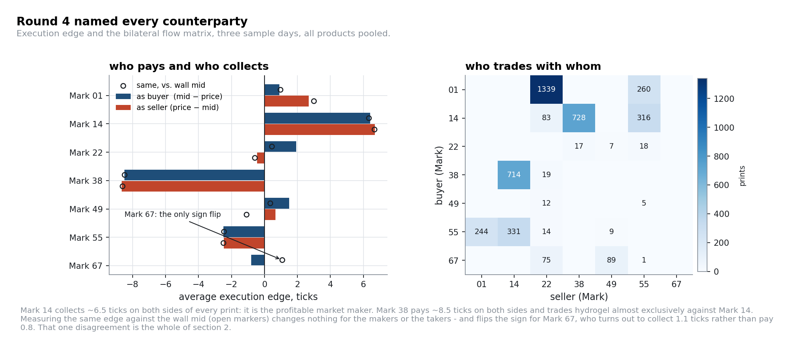
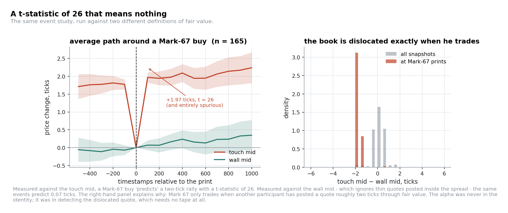

# Round 4: counterparties, and a t-statistic of 26 that meant nothing

**Products** unchanged from Round 3 · **New information** every print on the tape now carries a
counterparty identity: `Mark 01`, `Mark 14`, `Mark 22`, `Mark 38`, `Mark 49`, `Mark 55`, `Mark 67`

---

This is the shortest round to describe and the one we learned the most from: what we nearly believed
mattered more than what we traded.

## 1. Sorting the counterparties by execution edge

The question worth asking of a de-anonymised tape is "**who is providing liquidity and who is paying
for it?**", not "who is informed?" Measuring each participant's execution against the prevailing
mid at the time of their print, across the three sample days:

Do it twice: once against the touch mid, once against the wall mid.

| | buy / sell edge vs **touch** | buy / sell edge vs **wall** | prints | role |
|---|---:|---:|---:|---|
| `Mark 14` | **+6.41 / +6.69** | +6.33 / +6.68 | 2,172 | the profitable market maker |
| `Mark 01` | +0.90 / +2.69 | +0.97 / +3.00 | 1,843 | wide, deep market maker |
| `Mark 38` | **−8.49 / −8.65** | −8.48 / −8.61 | 1,478 | pays through the spread, both ways |
| `Mark 55` | −2.50 / −2.47 | −2.45 / −2.49 | 1,198 | pure taker: it pays exactly the 2.5-tick half-spread, on both sides, on velvetfruit only |
| `Mark 22` | +1.93 / −0.46 | +0.45 / −0.58 | 1,584 | posts quotes inside the spread |
| `Mark 49` | +1.50 / +0.67 | +0.35 / **−1.09** | 122 | same, on velvetfruit only |
| `Mark 67` | −0.80 / — | **+1.08** / — | 165 | **buys only, never sells** |

The two estimators agree, to within a tenth of a tick, for every market maker and every taker. They
disagree for exactly three participants, Marks 22, 49 and 67, and that disagreement is the signature
of a mechanism those three are part of, not noise. Mark 67 in particular goes from *paying*
0.8 ticks to *collecting* 1.08. Hold that number; §2 is about what happens if you miss it.

The bilateral flow matrix is sparse: Mark 38 trades hydrogel against Mark 14 in 98% of its prints,
Mark 67 buys velvetfruit from Marks 22 and 49 in 164 of its 165, which tells you these are programmed
roles rather than a crowd. Two immediately actionable readings:

- **Mark 38 is a price taker paying ~8.5 ticks.** Its prints mark the moments when someone is
  crossing the spread on hydrogel; the direction of that flow is the direction of the temporary
  pressure, and the prints themselves are a marker of where the touch is dislocated.
- **Mark 14 is the counterparty you are competing with.** Anything you quote is quoted against its
  book; its edge is what you are trying to take a share of.

## 2. The signal that was not there

`Mark 67` is the interesting one: 165 prints on `VELVETFRUIT_EXTRACT`, **always as the buyer, never as
the seller**. That is exactly what an informed directional participant looks like.

Run the obvious event study, the mean forward change of the mid after each of his prints:

| Horizon (timestamps) | 100 | 200 | 500 | 1,000 | 2,000 | 5,000 |
|---|---:|---:|---:|---:|---:|---:|
| Mean forward move (ticks) | +1.97 | +1.95 | +1.95 | +2.24 | +1.85 | +1.92 |
| t-statistic | **+26.3** | +19.8 | +13.0 | +10.2 | +6.0 | +3.9 |

A two-tick move within 100 timestamps, permanent out to 5,000, with a t-statistic of 26. If this were
a real market you would stop reading here and build the strategy.

Now re-run *exactly the same event study* against the wall mid, the midpoint of the deepest level on
each side, which is immune to thin quotes posted inside the spread:

| Horizon | 100 | 200 | 500 | 1,000 |
|---|---:|---:|---:|---:|
| Mean forward move, wall mid (ticks) | **+0.07** | +0.07 | +0.16 | +0.35 |

The right-hand panel of the figure explains the discrepancy in one number:

| | touch mid − wall mid |
|---|---:|
| all snapshots on `VELVETFRUIT_EXTRACT` | −0.02 (σ 0.54) |
| **at Mark-67 prints** | **−1.88** |
| quoted spread at Mark-67 prints | 1.63 (baseline 4.98) |

Mark 67 only trades when someone else, Mark 22 or Mark 49, has posted a thin quote roughly two
ticks *through* fair value. That quote drags the touch mid down; Mark 67 lifts it; the touch mid
snaps back as soon as the quote is gone. The "permanent price impact" was the disappearance of a
transient quote.

Three independent measurements of the same 1.9 ticks make the shape unambiguous. The touch mid **falls
1.78 ticks in the 100 timestamps before** the print, sits **1.88 ticks below** the wall mid **at** the
print, and **rises 1.97 ticks after** it. That is a round trip, not an impact, and the pre-event leg
alone should have stopped us: a signal cannot be caused by an event that has not happened yet.

The clinching number is in §1. Measured against the wall mid, Mark 67 **collects 1.08 ticks on every
trade, immediately, at execution**, where the touch mid says he pays 0.8. He is lifting offers that
are already cheap, not forecasting anything.

**Mark 67 is an arbitrageur, not an informed trader: we had built a detector for our own estimation
error.**

Worth being honest about how convincing this looked before we caught it. Taken on the touch mid alone,
the event study in the table above is not a marginal result: a t-statistic of 26.3 at the shortest
horizon, still 3.9 at 5,000 timestamps, decaying smoothly rather than collapsing into noise, which is
exactly the shape a genuinely informed trader should produce. Judged only on that table, there is no
statistical reason to reject it, and a signal that clears every significance bar you would normally
apply is precisely the kind that gets built into a live strategy off a short flag. It is the wall mid,
computed from data already on the tape, that actually distinguishes the two readings, and one open
marker on a bar chart settles which one is right.

## 3. What was actually tradable

The structure is real; it was simply never in the identity. Marks 22 and 49 sell velvetfruit at 0.84
and 1.09 ticks through the wall mid on average, and taking those offers is a genuine, if modest, edge.
Sized: the touch sits at least 1.5 ticks through the wall mid in **4.8% of velvetfruit snapshots**, with
a mean gap of 1.67 ticks when it does: a few hundred opportunities a day at a tick and a half each.

Detecting them requires only:

1. a fair value robust to quotes posted inside the spread (the wall mid), and
2. a comparison of the touch against it.

No tape, no identities, no event study. The information Round 4 handed everybody was, for this
particular structure, a red herring: a more precise fair value would have found it in Round 3.

Our submitted Round-4 algorithm used none of this. It was an improvement of the Round-3 book: the same
thirteen delta-adjusted voucher positions expressing velvetfruit's mean reversion, with EWMA reference
levels and shared-leg accounting, plus anchored band trading on hydrogel and the two deep-ITM strikes. That was a reasonable allocation of 48
hours: the option surface was where our edge was, and chasing counterparty behaviour is a research
project, but it means **this section is a reconstruction of what we should have built, not a
description of what we did**.

## 4. The transferable lesson

> Before believing an event study, re-run it against a different definition of the price. If the
> result depends on which mid you use, the result *is* the mid.

This generalises well beyond Prosperity. Any conditional statistic computed at event times inherits
whatever made those times special. If events are selected by a condition on the book, and a
counterparty who only trades when the book is dislocated selects exactly such times, then a
price estimator sensitive to that dislocation will manufacture impact out of nothing. The defences
are cheap:

- compute the same statistic with two or three independent price estimators;
- check the *pre-event* window, not just the post-event one: ours had already moved 1.78 ticks in the
  wrong direction *before* the print, which should have been the tell;
- measure the edge at execution, not only forward returns: a participant who collects a tick the instant
  he trades is arbitraging, whatever the forward path says;
- ask what is mechanically different about the moments you selected.

We got there, but only after building the pretty version of the chart first. Six months later, that
remains the most useful figure in this repository.

---

**Next:** [Round 5: fifty products](05-round-5-fifty-products.md)
