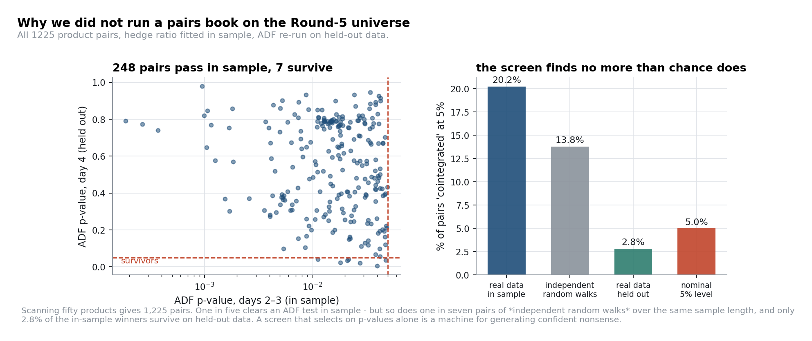
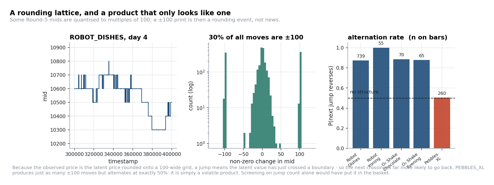
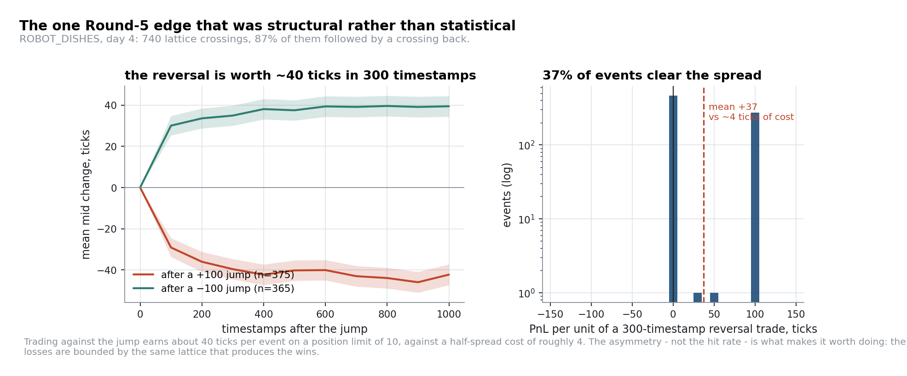
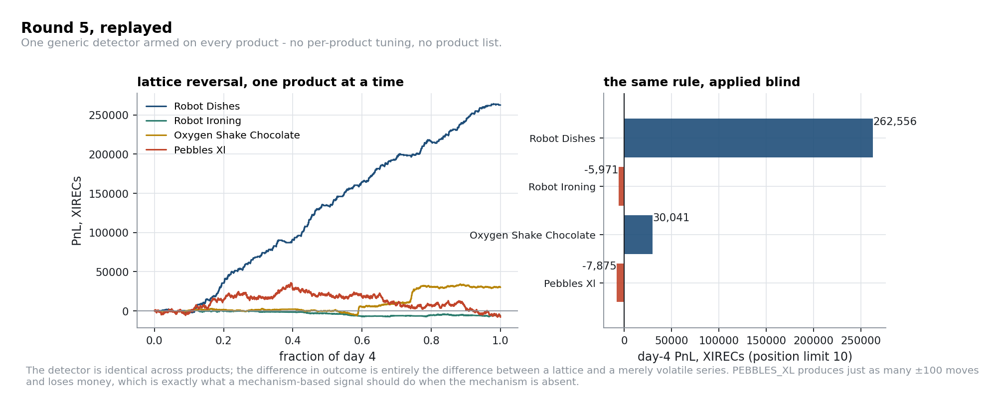
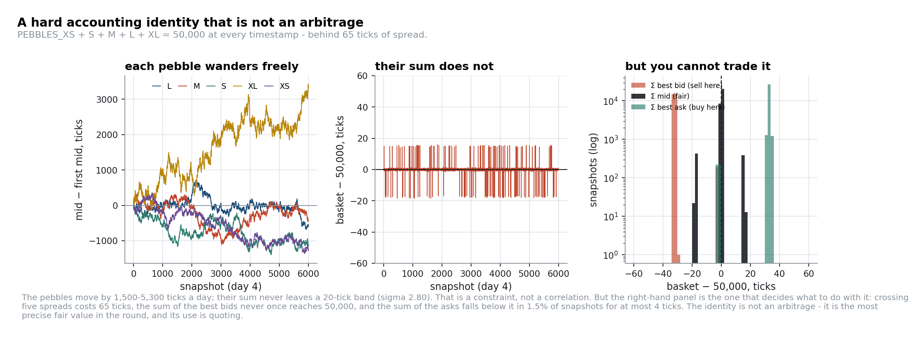
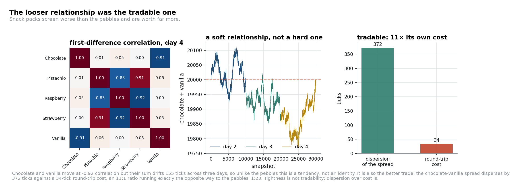
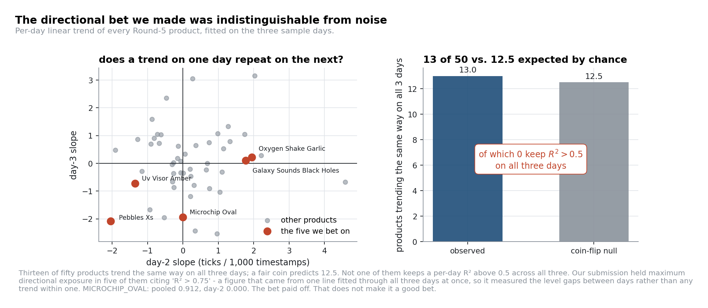

# Round 5: fifty products, forty-eight hours

**Products** 50 new goods in 10 families of 5; everything from earlier rounds delisted. Position
limit **10** on every product.
**Code** [`strategies/lattice_reversal.py`](../strategies/lattice_reversal.py) ·
[`research/figures/fig_round5.py`](../research/figures/fig_round5.py) ·
[`research/stats_tools.py`](../research/stats_tools.py) (`pairwise_coint_scan`, `random_walk_null`,
`detect_jumps`)

---

Round 5 is a search problem dressed as a trading problem. Fifty products, three days of history,
1,225 possible pairs, and two days to decide. The universe is designed so that *some* families
contain real structure and most do not, and the position limit of 10 means no single product can
carry the round: you need several genuine edges, or one very good one applied broadly.

The organising principle we used, and would use again:

> **Rank hypotheses by whether they have a mechanism, not by their p-value.**
>
> A mechanism is a reason the relationship must hold: an accounting identity, a rounding function, an
> option's intrinsic value, a physical constraint. Mechanisms survive out of sample and can be sized
> at the limit. Statistical relationships without a mechanism are, in a 50-product universe, mostly
> the multiple-testing artefact you would expect them to be.

## 1. The trap, quantified

The obvious first move is a cointegration screen over all pairs. We ran it, then did the thing that
matters: fitted the hedge ratio on days 2–3 and **re-tested the same hedge ratio on the held-out day 4**.

| | pairs | share |
|---|---:|---:|
| all pairs tested | 1,225 | — |
| ADF *p* < 0.05 in sample (days 2–3) | 248 | **20.2%** |
| …of which still *p* < 0.05 out of sample (day 4) | 7 | **2.8%** |
| *control: 50 independent random walks, same effective length* | *169* | ***13.8%*** |
| *nominal false-positive rate* | — | *5%* |

Read the bottom two rows first. Fifty *independent random walks* produce a 13.8% in-sample "hit rate"
on the same test, because a regression-plus-ADF screen over 1,225 pairs is not testing at the 5%
level in any meaningful sense. And the real data's in-sample winners survive on held-out data at
**below** the nominal false-positive rate.

There is nothing subtle here; it is the multiple-comparisons problem in its plainest form. But it is
worth running on the actual competition data rather than assuming, because seeing "248 pairs
cointegrated!" in your own notebook at 2 a.m. on day 2 is genuinely persuasive. It cost us about two
hours and it is why we did not submit a screen-driven pairs book at all. That caution was directionally
right, most of what the screen found was noise indistinguishable from the random-walk control. But it
was also blunt enough to sweep out the one pair, the snack-pack spread of §4, that turned out to have a
real mechanism and a favourable cost ratio. The screen protected us from the majority case and cost us
the minority case; telling the two apart needed the per-pair mechanism check in §4, not a blanket policy.

Two habits fall out of it:

- **Always run the null.** `random_walk_null(50, n)` takes one line and calibrates your screen.
- **Always hold out a day.** Two days in, one day out. Brutal, cheap, and it removed 97% of our
  candidates.

## 2. The mechanism: a rounding lattice

Several Round-5 products have mid prices that are **quantised**. On `ROBOT_DISHES`, day 4:

| | |
|---|---:|
| snapshots with mid ≡ 0 (mod 100) | 85% |
| share of non-zero mid changes that cross a grid line (\|Δ\| ≥ 80) | **30%** |
| …of which are exactly ±100 | 93% |
| 1st–99th percentile of \|jump\| given \|jump\| ≥ 80 | 98 – 102 |
| median time spent at one level | 300 timestamps |
| jumps observed | 740 |
| **P(next jump has the opposite sign)** | **87.3%** |

The generating story is straightforward: the observed price is a latent price passed through a
rounding function onto a 100-wide grid. A printed ±100 move therefore means the latent value has just
crossed a grid boundary, so it is currently sitting *at* that boundary, and the next crossing is far
more likely to be back across it than onward to the next one. This is a martingale argument, not a
regression, which is precisely why it holds out of sample.

The payoff is asymmetric in the right direction:

| | |
|---|---:|
| mean move over the 300 timestamps after a +100 jump | **−39.6** ticks |
| mean move over the 300 timestamps after a −100 jump | **+34.9** ticks |
| cost of crossing the spread to enter | ≈ 4 ticks |
| position limit | 10 |

### The decoy

The important panel is the third one in the lattice figure. `PEBBLES_XL` produces 261 jumps of ±100
across the three days, *more* than most of the genuine lattice products, and alternates at exactly
**50.4%**. It is a volatile product whose moves happen to be large, not a lattice. A screen
based on jump count puts it straight into the basket. A screen based on the mechanism (are the moves
*exactly* ±100? is the price pinned to multiples of 100? does the sign alternate?) excludes it.

Replaying one generic detector across products, with no per-product tuning, shows the separation:

| Product (day 4, limit 10) | replayed PnL |
|---|---:|
| `ROBOT_DISHES` | +262,556 |
| `OXYGEN_SHAKE_CHOCOLATE` | +30,041 |
| `ROBOT_IRONING` | −5,971 |
| `PEBBLES_XL` (the decoy) | −7,875 |

*(Replay caveats in [`research/replay.py`](../research/replay.py): treat the magnitudes as a lower
bound and a comparison, not a score estimate.)*

### Arm it everywhere

`ROBOT_IRONING` shows 56 jumps on day 2 with **100%** alternation and none at all on day 4;
`ROBOT_DISHES` is the reverse: silent on days 2 and 3, 740 jumps on day 4. The regimes switch on and
off between days. Hard-coding the four products that happened to be active in the sample data is
therefore a bet on which day you are given; arming a generic detector on all 50 costs a little in
market-making PnL on the inactive ones and removes that bet entirely. Our submission did hard-code
the list, and it worked, but the reasoning was wrong, and the version in
[`strategies/lattice_reversal.py`](../strategies/lattice_reversal.py) is the one we would ship now.

## 3. An exact identity, and why it is not an arbitrage

`PEBBLES_XS + PEBBLES_S + PEBBLES_M + PEBBLES_L + PEBBLES_XL = 50,000`

| Day | mean of the basket | σ | min | max |
|---|---:|---:|---:|---:|
| 2 | 49,999.91 | 2.82 | 49,981.5 | 50,016.0 |
| 3 | 49,999.97 | 2.76 | 49,981.5 | 50,016.5 |
| 4 | 49,999.94 | 2.82 | 49,981.5 | 50,016.0 |

The individual pebbles move by 1,500 to 5,300 ticks over a single day. Their sum never leaves a
20-tick band, on any day. This is a hard accounting identity: no stationarity test needed, immune to
the multiple-testing problem of §1, and it holds at every timestamp.

The instinct is to call it an arbitrage. Price it in executable terms first:

| | ticks |
|---|---:|
| σ of the basket's deviation from 50,000 | **2.80** |
| median spread of a single pebble | 9 – 17 |
| executable basket width, $\sum \text{ask} - \sum \text{bid}$ | **65** |
| ratio | **23 : 1** |
| snapshots where $\sum \text{bid} > 50{,}000$ (basket sellable rich) | **0.000%** |
| snapshots where $\sum \text{ask} < 50{,}000$ (basket buyable cheap) | 1.49%, best edge **+4** |

Crossing five spreads costs 65 ticks to capture a signal whose whole standard deviation is 2.8, and in
three days there is **not one snapshot** where the basket could be sold above fair. Taking a directional
position on the deviation is not viable at any size the spread allows; the 23:1 ratio above rules it out
on its own, independent of any model of the residual.

That is the right way to use it. The identity's real value is as **the most precise fair value in the
round**, not a trade: given four pebbles you know the fifth exactly, so you can quote all five around a
value with no estimation error in it. We market-made the pebbles, which was the correct monetisation, but
we did it off a generic mid rather than off the constraint, which is the version we would ship now. It is the
same lesson as the deep-ITM vouchers in [Round 3](03-round-3-voucher-surface.md#3-trade-one-a-fair-value-you-derive-rather-than-estimate):
knowing fair value exactly is a quoting edge, and the market has already removed the taking edge.

## 4. The one we actually left on the table

The snack-pack family is the mirror image of the pebbles, and we filed it as the decoy.

| | |
|---|---:|
| corr(Δchocolate, Δvanilla) | −0.92 |
| corr(Δstrawberry, Δraspberry) | −0.92 |
| chocolate + vanilla, day 2 / 3 / 4 | 20,025 / 19,927 / 19,870 |
| σ of that sum within a day | 42 / 32 / 48 |
| **σ of the chocolate − vanilla spread** | **372** |
| **round-trip cost of the pair (2 × 17-tick spreads)** | **≈ 34** |
| ratio | **11 : 1, in favour** |

The *level* is not a constraint: the pair sum drifts 155 ticks across three days, and the within-day
dispersion is fifteen times the pebbles'. We were right that this is a tendency rather than an
identity, and then drew the wrong conclusion from it: dispersion against cost decides tradability, not
how tight the relationship is. Here the ratio runs 11:1 *the right way*, exactly inverting the pebbles.

We identified the correct trade and did not take it. The ratio above, 11:1 in favour with a spread
standard deviation more than ten times the round-trip cost, is on its own enough to size a real
position: at the position limit of 10, capturing even a fraction of a 372-tick spread on a handful of
round trips a day is a material edge, larger than the pebbles' quoting edge in §3. We market-made the
family like any other product and never traded the mirror.

**The general lesson, and it is the one that cost us most in this round:** an exact relationship with a
wide spread is a fair value, and a loose relationship with a wide dispersion is a trade. We had both in
front of us and correctly identified which was which. Then we judged tradability by tightness rather
than dispersion-over-cost, which was the wrong test. Ranking the two by the same executable-width test
takes five minutes.

## 5. The bet we got away with

Our submitted Round-5 algorithm had three layers: passive market making across the whole universe as
a floor, the lattice detector on four products, and **maximum directional exposure in five products
from tick zero**, held all day. The third layer is the part that needs explaining.

The code comments justify those five with "R² > 0.75", quoting 0.806, 0.785, 0.912, 0.912 and 0.900.
Those numbers are real; they are just not measuring what the comment claims. They are the R² of a single
straight line fitted through **all three days concatenated**, and in a panel like that the fit is
dominated by the *level differences between* days rather than by any trend *within* a day:

| Our pick | pooled 3-day R² | day-2 R² | day-3 | day-4 | day-2 slope | day-3 | day-4 |
|---|---:|---:|---:|---:|---:|---:|---:|
| `MICROCHIP_OVAL` | 0.912 | **0.000** | 0.832 | 0.904 | −0.01 | −1.95 | −1.79 |
| `UV_VISOR_AMBER` | 0.912 | 0.884 | 0.678 | **0.026** | −1.35 | −0.73 | −0.10 |
| `PEBBLES_XS` | 0.900 | 0.906 | 0.746 | 0.463 | −2.04 | −2.08 | −1.15 |
| `OXYGEN_SHAKE_GARLIC` | 0.806 | 0.729 | **0.048** | 0.910 | +1.95 | +0.21 | +2.28 |
| `GALAXY_SOUNDS_BLACK_HOLES` | 0.785 | 0.846 | **0.007** | 0.591 | +1.78 | +0.10 | +1.41 |

*(slopes in ticks per 1,000 timestamps)*

`MICROCHIP_OVAL` is the clean case: a pooled R² of 0.912 and a day-2 R² of **0.000** on a slope of −0.01.
It simply started day 3 lower, with no trend on day 2 at all. Every one of the five collapses on at
least one day, and the screen that selected them could not see that because it never looked inside a day.

The population check says the same thing:

| | |
|---|---:|
| products whose per-day trend has the same sign on all three days | **13 of 50** |
| expected under a fair coin | **12.5** |
| of those 13, how many keep per-day R² > 0.5 on *all three* days | **0** |

Thirteen against a coin-flip expectation of twelve and a half. Judged as research, this layer was
indistinguishable from noise, and the mistake was structural rather than careless: **fit the model at
the frequency you intend to trade at.** A trend you will hold for one day has to be visible in one day.

That comparison can be made precise instead of just eyeballed. Under the null that a product's daily
trend sign is an independent coin flip, the chance of matching on all three sampled days is $2 \times
0.5^3 = 25\%$, so 50 independent products should produce about 12.5 matches by chance alone. Treating
the 50 products as independent Bernoulli(0.25) trials and testing the observed count of 13 against
that null gives $P(X \geq 13) \approx 0.49$: about as unremarkable a result as one can get, almost
exactly the expected value. There is no population-level evidence that a high pooled R² identifies
real day-to-day persistence, and the five products we picked fail individually in the same way (the
table above). Put those two facts together and the honest prior on each of our five picks was close
to a coin flip, not the 80-90% the R² figures implied.

Judged as a *tournament decision*, it is more defensible than that makes it sound, provided the odds
are stated honestly rather than dressed up as a finding. We accepted five roughly 50/50 bets, sized at
the position limit, because the leaderboard rewards rank rather than expected PnL, and late in a round
a wider distribution of outcomes can beat a safe one. We knew the odds going in, not just the payoff.

Both things are true, and keeping them separate is the discipline:

- **as a bet:** a set of coin-flip-odds positions, deliberate and correctly sized to the objective;
- **as a finding:** unsupported, and it must not be carried into next year's priors.

The market-making floor and the lattice trade were the edge. The directional overlay was variance
we chose to accept, and we would rather say that plainly than let it read as more than it was.

---
